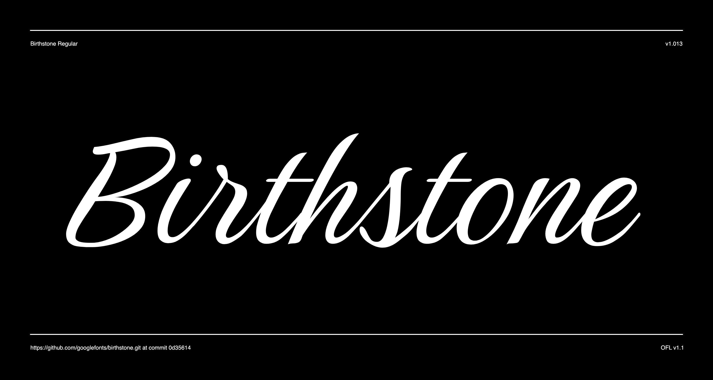

# Birthstone

The Birthstone Family is a set of fonts that are not only diverse but perfectly compatible to interchange styles in a single block of text. There are three precious stylistic sets: Script, Casual, and Formal, plus a Titling set.

For added luster, there is the sibling Birthstone Bounce (both Medium and Light weights) a version that includes caps and ending swashed forms. All the styles are uniquely compatible to one another, but distinctly different. See how easily the fonts may change according to the needs of the look.



## Building the Fonts

The font is built using fontmake and gftools post processing script. Tools are all python based, so it must be previously installed.

To install all the Python tools into a virtualenv, do the following:

From terminal:

```

cd your/local/project/directory

#once in the project folder create a virtual environment. 
This step has to be done just once, the first time:

python3 -m venv venv

#activate the virtual environment

source venv/bin/activate

#install the required dependencies

pip install -r requirements.txt

```

Then run the this command:

```
cd sources
gftools builder config.yml
```
